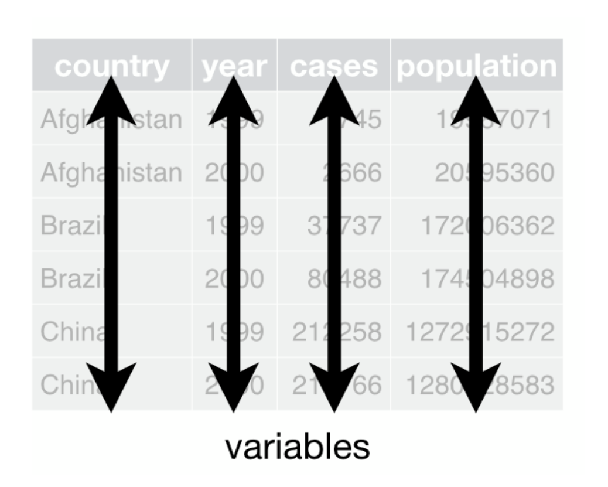
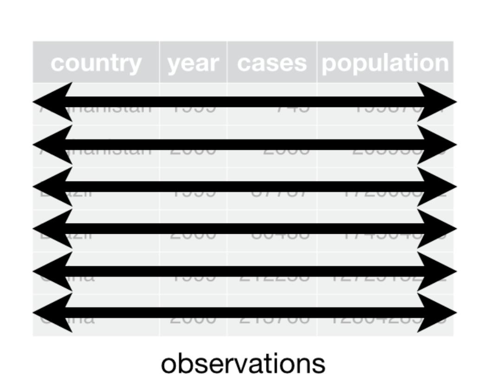
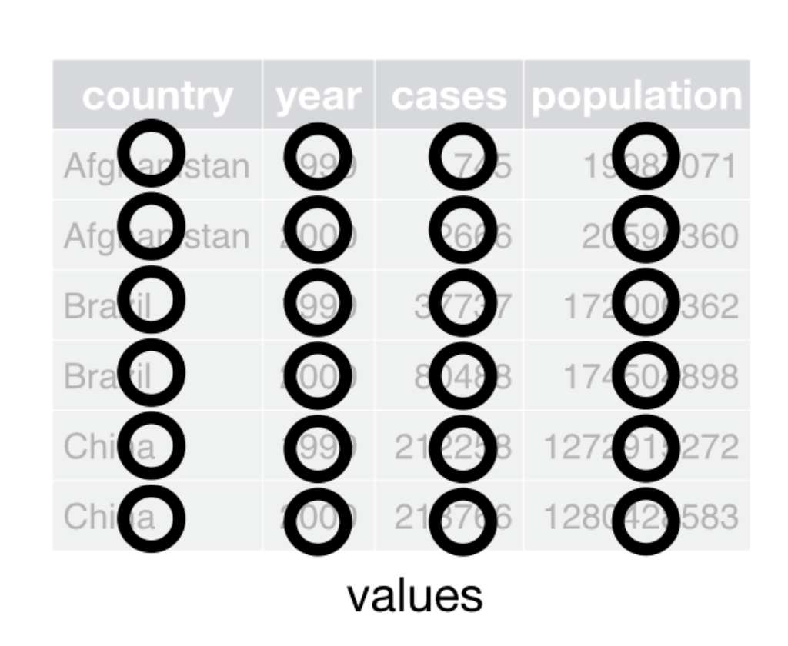
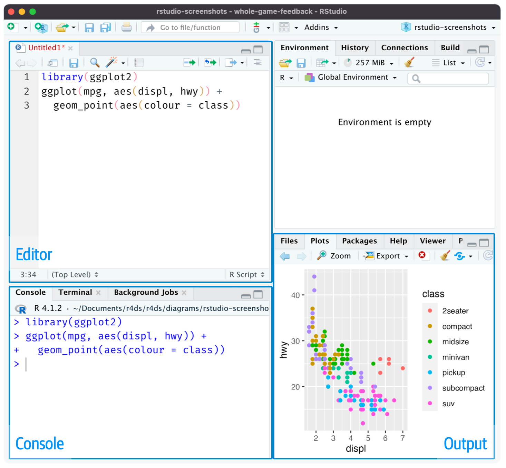
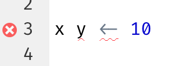
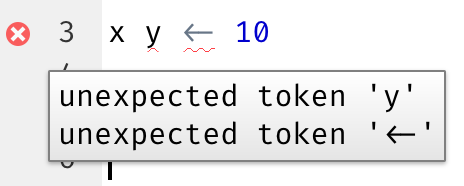
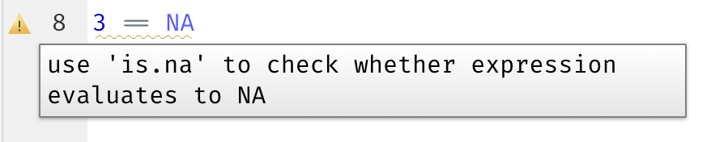
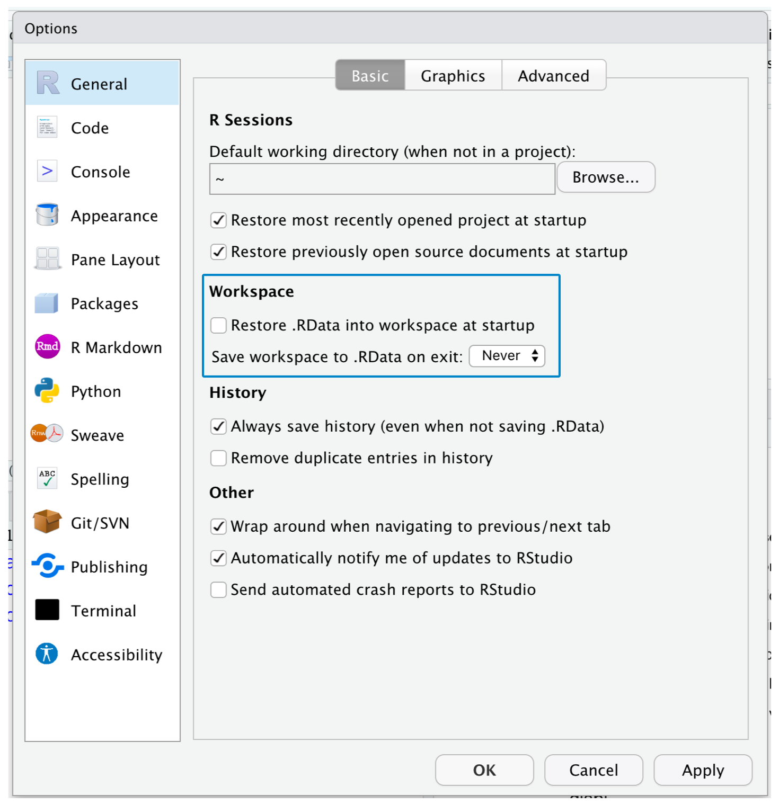
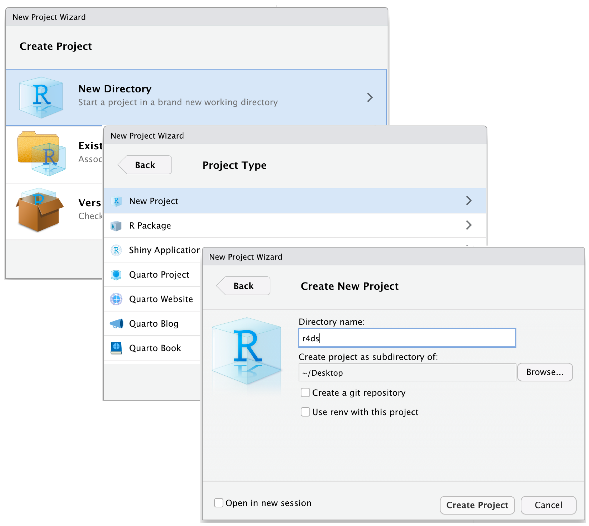

```{r config, include=F, echo=F}

# 1. Opciones generales ----


## 1.1 Seteo general de entorno ----

options(scipen = 999, expressions = 10000, htmltools.dir.version = FALSE)

## 1.2 Librerías ----

c("devtools", "pacman", "R.utils") |>
  sapply(
    \(x)
    if (system.file(package = x) == "") {
      install.packages(x)
    }
  ) |>
  invisible()


pacman::p_load(
  qs, openxlsx, # Archivos  
  data.table, kit, here, magrittr, tidyverse, collapse # Generales
)

## 1.3 Configuración de la presentación

if (!file.exists(here("egoipse_reveal.scss"))) {
  download.file(
    "https://www.dropbox.com/scl/fi/ys81ey95r1pc6frs4san4/egoipse_reveal.scss?rlkey=dox9v5jke5tk8ngv0caeylv6j&st=1vsz9635&dl=1",
    here("egoipse_reveal.scss")
  ) 
}


```

## Contenido

::: fragment

### Capítulo 5: Data tidying

#### Tidy data

#### Pivoteo para alargar

#### Pivoteo para ensanchar

:::

<br>

::: fragment

### Capítulo 6: Scripts and projects

#### Scripts

#### Proyectos

:::

# Capítulo 5: Data tidying {background-color="#1565C0"}

## La estrategia del "tidy data"

::: incremental

- El capítulo 5 del libro es probablemente el más conceptual de todos.

- **Explica en él la "estrategia" tidy, que es de lo que trata no sólo el libro, sino toda la metalibrería `tidyverse`**.

- Wickham y Grolemund la definen como "una forma consistente de organizar los datos".

- Presentan los paquetes del tidyverse como las herramientas para seguir esa estrategia.

- El capítulo se centra en particular en las funciones `pivot_*` del paquete `tidyr`.

:::

## ¿Qué es "tidy data"?

El libro muestra tres ejemplos distintos de organizar los mismos datos^[Join de los datasets `who` y `population` del paquete `tidyr`.].


:::: {.columns .fragment .texto-muy-pequegno} 


::: {.column width="30%"}

**Ejemplo 1**

```{r ejemplo1, include=T, echo=F}

(
  ejemplo <- who |>
    fmutate(cases = apply(who |> get_vars("\\w_\\w", regex = T), 1, fsum)) |>
    fsubset(
      year %in% c(1999, 2000) & country %in% c("Afghanistan", "Brazil", "China"), # Filas
      country, year, cases # Columnas
    ) |>
    left_join(population)
)


```

:::


::: {.column width="30%"}

**Ejemplo 2**

```{r ejemplo2, include=T, echo=F}
(
  ejemplo2  <- ejemplo |>
  pivot_longer(
    cols = c("cases", "population"),
    names_to = "type",
    values_to = "count"
  )
)

```

:::


::: {.column width="30%"}

**Ejemplo 3**

```{r ejemplo3, include=T, echo=F}
(
  ejemplo3 <- ejemplo |>
    fmutate(
      rate = paste(cases, population, sep = "/"),
      .keep = c("country", "year", "rate")
    )
)

```

:::


::::


## ¿Qué es "tidy data"?

Tres condiciones debe cumplir una organización de datos para que se considere ***tidy***:


:::: {.columns .center .texto-pequegno} 


::: {.column .fragment .centrar width="33%"}

**1. Cada columna debe ser una variable. Y viceversa.**




:::


::: {.column .fragment .centrar width="33%"}

**2. Cada observación es una fila. Y viceversa.**



:::


::: {.column .fragment .centrar width="33%"}

**3. Cada valor es una celda. Y viceversa.**



:::

::::

## ¿En qué fallan los ejemplos?

:::: {.columns .fragment .texto-muy-pequegno} 


::: {.column width="30%"}

**Ejemplo 1**

```{r ejemplo1a, include=T, echo=F}
ejemplo

```

:::


::: {.column width="30%"}

**Ejemplo 2**

```{r ejemplo2a, include=T, echo=F}
ejemplo2

```

:::


::: {.column width="30%"}

**Ejemplo 3**

```{r ejemplo3b, include=T, echo=F}

ejemplo3 

```

:::


::::

## ¿Por qué tidy?

::: incremental

1. Es más provechoso tener una forma consistente de organizar datos; permite ahorrar tiempo y trabajo usando las herramientas adecuadas para esa forma o estructura;

2. Aprovecha la naturaleza vectorizada de R al trabajar con las columnas como vectores.

3. Yapa: Es muy fácil manipular datos con la estructura tidy.

:::

## Ejemplos 


:::: {.columns .center .texto-muy-pequegno} 


::: {.column .fragment .centrar width="33%"}

Tasa por cada 10.000 habitantes

```{r ejemplo_codigo1_, include=T, echo=T}

ejemplo |>
  mutate(rate = cases / population * 10000)


```


:::


::: {.column .fragment .centrar width="33%"}

Nro total de casos por año

```{r ejemplo_codigo2_, include=T, echo=T}

ejemplo |>
  group_by(year) |> 
  summarize(total_cases = sum(cases))


```


:::


::: {.column .fragment .centrar width="33%"}

Evolución en el tiempo

```{r ejemplo_codigo3_, include=T, echo=T}

ejemplo |>
  ggplot(aes(x = year, y = cases)) +
  geom_line(
    aes(group = country),
    color = "grey50"
    ) +
  geom_point(
    aes(color = country, shape = country)
    ) +
  scale_x_continuous(
    breaks = c(1999, 2000)
  ) +
  theme(
    axis.title = element_text(size = 20),
    axis.text = element_text(size = 18),
    legend.title = element_text(size = 15),
    legend.text = element_text(size = 13)
  )


```


:::

::::

## Pivotar

::: incremental

- Como la mayor parte de los datos no se encuentran en formato tidy, un gran volumen del trabajo con datos, según Wickham y Grolemund, consiste en transformarlos a este formato.

- Una de las principales herramientas para eso es el pivoteo.

- Hay dos tipos de pivoteo: pivoteo para alargar y pivoteo para ensanchar las estructuras de datos.

:::

## Pivoteo para alargar

::: incremental

- Consiste en reorganizar los datos para reducir el número de columnas (variables) y aumentar el número de filas (casos).

- Para ello, se usa la función `pivot_longer()` de `tidyverse`

- El libro muestra cómo funciona con el dataset `Bilbooard`: una lista de canciones y su respectiva posición en el ranking Bilboard por semana.

:::

## Pivoteo para alargar

:::: {.columns .center .texto-muy-pequegno} 


::: {.column .fragment .centrar width="48%"}

Formato original

```{r bilboard1, include=T, echo=T}

billboard |>  
  print(n = 20)

```

:::


::: {.column .fragment .centrar width="48%"}

Pivoteo para alargar

```{r bilboard2, include=T, echo=T}

billboard |> 
  pivot_longer(
    cols = starts_with("wk"), 
    names_to = "week", 
    values_to = "rank"
  ) |>
  print(n = 20)

```


:::

::::


## Pivoteo para ensanchar

::: incremental

- Es la operación inversa a alargar. Consiste en reorganizar los datos para reducir el número de filas (casos) y aumentar el número de columnas (variables).

- Para ello, se usa la función `pivot_wider()` de `tidyverse`

- El libro muestra cómo funciona con el dataset `cms_patient_experience`: una lista de valoraciones de pacientes de su experiencia con  Centers of Medicare and Medicaid.

:::


## Pivoteo para ensanchar

:::: {.columns .center .texto-muy-pequegno} 


::: {.column .fragment .centrar width="48%"}

Formato original

```{r medic1, include=T, echo=T}

cms_patient_experience |>  
  print(n = 20)

```

:::


::: {.column .fragment .centrar width="48%"}

Pivoteo para ensanchar

```{r medic2, include=T, echo=T}

cms_patient_experience |> 
  pivot_wider(
    id_cols = starts_with("org"),
    names_from = measure_cd,
    values_from = prf_rate
  ) |>
  print(n = 20)

```


:::

::::


# Capítulo 6: Scripts and projects{background-color="#1565C0"}

## Presentación

::: incremental

- El capítulo 6 es uno de los 3 sobre flujos de trabajo que intercalan los autores en la exposición de la manipulación de datos para sugerir rutinas y prácticas que mejoren la productividad con R.

- Este en particular está enfocado a flujos de trabajo con RStudio. **Alto riesgo de quedar obsoleto pronto**.

- Plantea recomendaciones para uso de scripts y la organización del trabajo con datos y scripts en proyectos de RStudio.

:::

## Scripts


:::: {.columns .center .texto-muy-pequegno} 


::: {.column .fragment .centrar width="48%"}



:::


::: {.column .fragment .centrar width="48%"}







:::

::::


## Proyectos


:::: {.columns .center .texto-muy-pequegno} 


::: {.column .fragment .centrar width="48%"}



:::


::: {.column .fragment .centrar width="48%"}



:::

::::

## Rutas relativas y absolutas

::: incremental

- Los autores recomiendan que, una vez creado el proyecto, siempre se usen rutas relativas, no absolutas.

- Esto facilita portar el proyecto entre dispositivos: es muy improbable que dos o más personas usen la misma estructura de carpetas"

:::

## {background-color="#1565C0" .center}

::: {.centrar}

### Para más información:<br>

### [danielgimenez.me](https://danielgimenez.me){.enlace_amarillo}

### [daniel.gimenez@me.com](mailto:daniel.gimenez@me.com){.enlace_amarillo}

:::


