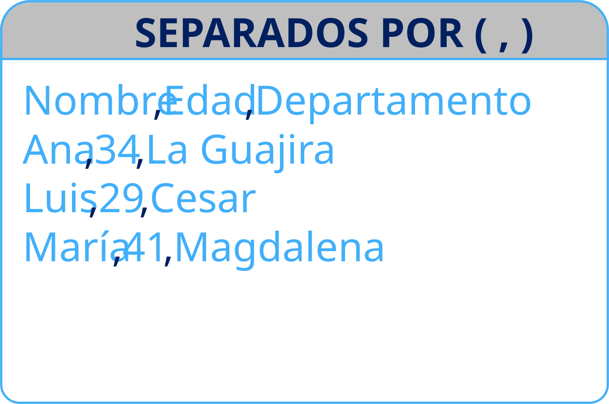
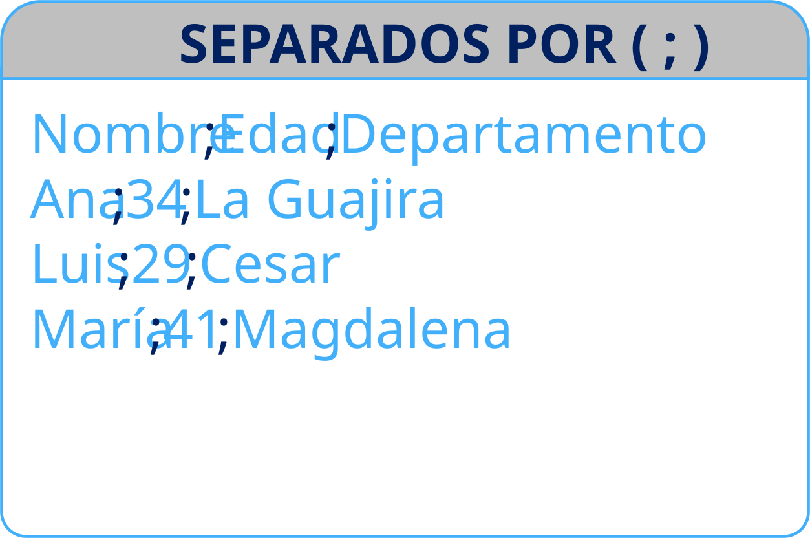
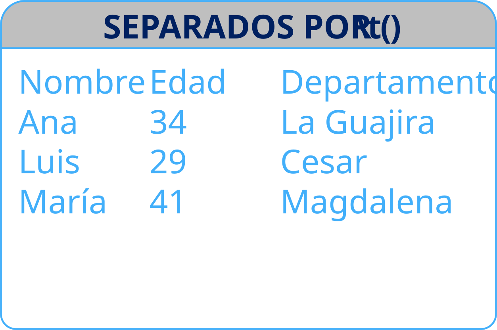
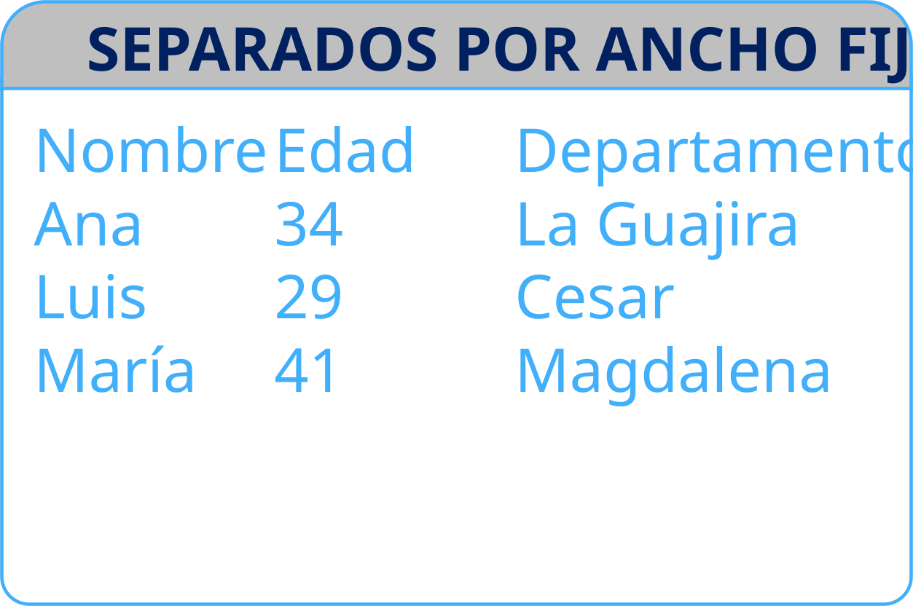
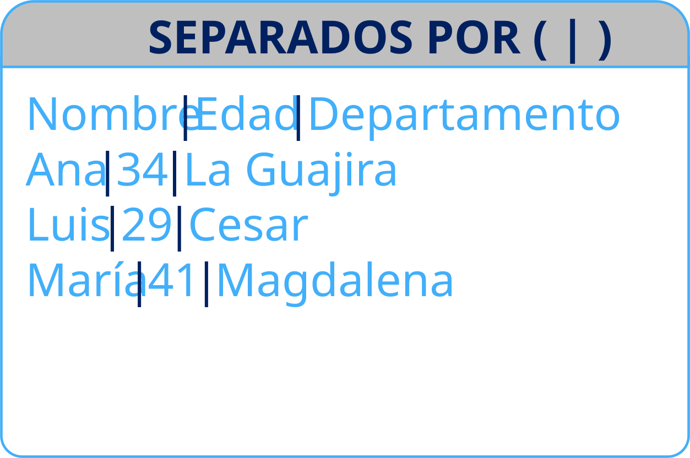
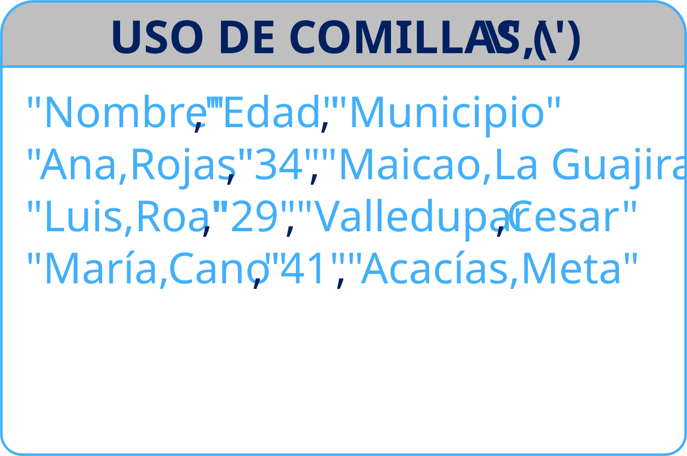

## 1. INTRODUCCIÓN


## 1. INTRODUCCIÓN {.smaller}

<p align="justify">Importar datos de manera eficiente es el primer paso para cualquier análisis confiable. Una buena estrategia de importación no solo garantiza que la información llegue limpia y estructurada, sino que también permite detectar errores desde el origen, ahorrar tiempo en tareas repetitivas y facilitar la automatización de procesos. Dominar esta etapa es clave para construir flujos de trabajo reproducibles, escalables y alineados con los objetivos operativos. <span style = "color: #42affa; font-weight: bold;" >Este capítulo se centrará en la lectura de archivos rectangulares de texto plano teniendo en cuenta consejos prácticos para:</span></p>

:::: {.columns}

::: {.column width = "35%"}

::: {.incremental}
-   Importar un archivo
-   Gestionar:
    -   Datos faltantes
    -   Nombres de columnas
    -   Tipos de datos
-   Importar múltiples archivos
-   Importar datos manualmente
-   Exportar datos
:::
:::

::: {.column width = "65%"}

{.fragment fig-align="center" width="600"}

:::

::::


## 2. PREREQUISITOS
Para esta sesión ocuparemos las siguientes librerías:
<br>
<br>

```{r}
#| echo: true

library(tidyverse) # De la cual usaremos las funciones de los paquetes `readr`, `dplyr` y `purrr`
library(janitor)   # Este paquete lo ocuparemos para la estandarización de los nombres de las columnas.
library(fs)        # Se ucupará para gestionar rutas a los archivos.

```

<br>
Adicional a los paquetes emplearemos los archivos que se encuentran en la carpeta `./datos`


## 3. ESTRUCTURA DE UN ARCHIVO CON DATOS SEPARADO POR DELIMITADORES

:::: {.columns}
::: {.column width = "33.3%"}
{fig-align="center" width="500"}
{fig-align="center" width="500"}
:::
::: {.column width = "33.3%"}
{fig-align="center" width="500"}
{fig-align="center" width="500"}
:::
::: {.column width = "33.3%"}
{fig-align="center" width="500"}
{fig-align="center" width="500"}
:::

::::


# 4. LEER DATOS DESDE UN ARCHIVO
## 4. LEER DATOS DESDE UN ARCHIVO

`read_delim` es una de las 20 funciones del paquete `readr` que se puede emplear para leer datos tabulares almacenados en archivos de texto como .txt o .csv.

```R
read_delim(
  file,                       # Una ruta absoluta, relativa o url del archivo del cual se leeran los datos.
  delim = NULL,               # El carácter que se ocupara como delimitador de los campos.
  col_names = FALSE,          # Indica si el archivo contiene los nombres de las variables como su primera línea.
  col_types = NULL            # Para definir el tipo de datos de cada columna.
  col_select = NULL           # Nombre(s) de las columnas que se incluiran en el resultado.
  locale = default_locale(),  # Para modificar la configuración regional que controla aspectos como la zona horaria 
                              # predeterminada, la codificación, el signo decimal, la marca grande y los nombres 
                              # de los días y meses.
  na = c("", "NA"),           # Un vector de caracteres de cadenas que se deben interpretar como valores NA.
  name_repair = "unique"      # Para el manejo del nombre de las columnas.
  )
```

::: {.center-flex}
{.fragment fig-align="center" width="200"}
{.fragment fig-align="center" width="200"}
{.fragment fig-align="center" width="200"}
:::


## 4. LEER DATOS DESDE UN ARCHIVO
### Otras funciones

<br>

:::: {.columns}

::: {.column width="25%"}
<center><b>base</b></center>

- `read.csv`
- `read.csv2`
- `read.delim`
- `read.fwf`
- `read.table`
:::

::: {.column width="25%"}
<center><b>readr</b></center>

- `read_csv`
- `read_csv2`
- `read_delim`
- `read_tsv`
- `read_fwf`
- `read_lines`
- `read_file`
- `read_log`
- `read_rds`
- `read_table`
:::

::: {.column width="25%"}
<center><b>vroom</b></center>

- `vroom`
:::

::: {.column width="25%"}
<center><b>data.table</b></center>

- `fread`
:::

::::


## 4. LEER DATOS DESDE UN ARCHIVO
### Leer un archivo en local

```{r}
#| echo: true
#| message: true

library(readr)

(
estudiantes <- read_delim(
  file = "datos/students.csv"
  )
)

```


## 4. LEER DATOS DESDE UN ARCHIVO
### Leer un archivo desde un repositorio web

```{r}
#| echo: true
#| message: true

#library(readr)

(
estudiantes <- read_delim(
  file = "https://pos.it/r4ds-students-csv"
  )
)

```


## 4. LEER DATOS DESDE UN ARCHIVO
### Consejos practicos: Manejo de `NA`

<br>
<br>

```{r}
#| echo: true
estudiantes

```

## 4. LEER DATOS DESDE UN ARCHIVO
### Consejos practicos: Manejo de `NA`

```{r}
#| echo: true

#library(readr)

(
estudiantes <- read_delim(
  file = "datos/students.csv",
  na = c("", "NA", "N/A")
  )
)


```

## 4. LEER DATOS DESDE UN ARCHIVO
### Consejos practicos: Nombres no sintaticos

<br>
<br>

```{r}
#| echo: false
# Cargar librería
library(gt)

# Crear data.frame con sintaxis y ejemplos
nombres_columnas <- data.frame(
  Sintaxis = c("snake_case", "camelCase", "PascalCase", "UPPER_SNAKE_CASE", "dot.case"),
  Ejemplos = c(
    "fish_count, average_weight",
    "fishCount, averageWeight",
    "FishCount, AverageWeight",
    "FISH_COUNT, AVERAGE_WEIGHT",
    "fish.count, average.weight"
  ),
  Uso = c(
    "Preferido en tidyverse y Quarto",
    "Usado en APIs y shiny",
    "Clases en R6/S4 (no para columnas)",
    "Constantes o columnas exportadas",
    "Funciones base de R (evitar en columnas)"
  ),
  stringsAsFactors = FALSE
)

# Crear tabla gt con estilo Reveal.js oscuro
tabla_columnas <- gt(nombres_columnas) |>
  tab_header(
    title = "Estilos de Nombres de Columnas en R",
    subtitle = "Comparación de sintaxis, ejemplos y uso"
  ) |>
  cols_label(
    Sintaxis = "Tipo de sintaxis",
    Ejemplos = "Ejemplos de columnas",
    Uso = "Uso típico"
  ) |>
  tab_style(
    style = list(
      cell_text(size = px(20), color = "white"),
      cell_borders(sides = "all", color = "white", weight = px(1))
    ),
    locations = cells_body()
  ) |>
  tab_style(
    style = list(
      cell_text(size = px(20), color = "white", weight = "bold"),
      cell_borders(sides = "all", color = "white", weight = px(1))
    ),
    locations = cells_column_labels()
  ) |>
  tab_style(
    style = cell_text(color = "white", weight = "bold", size = px(25)),
    locations = cells_title(groups = "title")
  ) |>
  tab_style(
    style = cell_text(color = "white", size = px(16)),
    locations = cells_title(groups = "subtitle")
  ) |>

  tab_options(
    table.background.color = "transparent",
    heading.background.color = "transparent",
    column_labels.background.color = "transparent",
    table.width = pct(100)
  )

```

:::: {.columns}

::: {.column .fragment width = "28%"}
<b>Nombres no sintaticos:</b>

```{r}
#| echo: true
nombres <- names(estudiantes)

for (nombre in nombres) {
  print(
    as.symbol(nombre)
  )
}
```
:::
::: {.column .fragment width = "29%"}
<b>Renombrado de columnas:</b>

```{r}
#| echo: true

estudiantes |>
  dplyr::rename(
    student_id = `Student ID`,
    full_name = `Full Name`
  ) |> 
    names() |> 
    cat(sep ="\n")
```

:::

::: {.column .fragment width = "43%"}

```{r}
#| echo: false
tabla_columnas
```

:::

::::

## 4. LEER DATOS DESDE UN ARCHIVO
### Consejos practicos: Nombres no sintaticos

:::: {.columns}

::: {.column .fragment width = "33.3%"}
<b>Estandarizar nombres 1:</b>

```{r}
#| echo: true

library(janitor)

estudiantes |> 
  clean_names() |> 
  names() |> 
  cat(sep ="\n")

```
:::

::: {.column .fragment width = "33.3%"}
<b>Estandarizar nombres 2:</b>

```{r}
#| echo: true
library(janitor)

read_delim(
  file = "datos/students.csv",
  delim = ",",
  na = c("", "NA", "N/A"),
  name_repair = make_clean_names
  ) |> 
  names() |> 
  cat(sep ="\n")


```
:::

::: {.column .fragment width = "33.3%"}
<b>Estandarizar nombres 3:</b>

```{r}
#| echo: true

nom_col <- c(
  "student_id",
  "full_name",
  "favourite_food",
  "meal_plan",
  "age"
  )

read_delim(
  file = "datos/students.csv",
  delim = ",",
  na = c("", "NA", "N/A"),
  col_names = nom_col,
  skip = 1
  ) |> 
  names() |> 
  cat(sep ="\n")

```

:::

::::

## 4. LEER DATOS DESDE UN ARCHIVO
### Consejos practicos: Cambio de tipo

:::: {.columns}

::: {.column .fragment width = "50%"}
<b>El problema:</b>

```{r}
#| echo: true

estudiantes <- read_delim(
  file = "datos/students.csv",
  delim = ",",
  na = c("", "NA", "N/A"),
  name_repair = make_clean_names
  )

dplyr::glimpse(tail(estudiantes,2))

```

:::

::: {.column .fragment width = "50%"}
<b>Una solución:</b>

```{r}
#| echo: true

estudiantes |>
  dplyr::mutate(
    meal_plan = as.factor(meal_plan),
    age = ifelse(age == "five", 5L, as.integer(age))
  ) |> 
  tail(2) |> 
  dplyr::glimpse()
```
:::

::::


## 4. LEER DATOS DESDE UN ARCHIVO {.smaller}
### Consejos practicos: Cambio de tipo

<p align="justify">`readr` ofrece un total de nueve tipos de columnas:

- `col_logical()` y `col_double()` leen números lógicos y reales.
- `col_integer()` lee enteros (ocupan la mitad de espacio en comparación un double) 
- `col_character()` lee strings o cadenas de caracteres.
- `col_factor()`, `col_date()` y `col_datetime()` crean columnas de tipo factor, fecha y fecha-hora respectivamente.
- `col_number()` es un analizador numérico permisivo que ignora los componentes no numéricos y es particularmente útil para monedas.
- `col_skip()` omite una columna para que no se incluya en el resultado.

También es posible anular la columna predeterminada cambiando de `list()` a `cols()` y especificando `.default`</p>


## 4. LEER DATOS DESDE UN ARCHIVO
### Consejos practicos: Cambio de tipo

:::: {.columns}
::: {.column .fragment width = "33.3%"}

```{r}
#| echo: true
datos <- r"(
x,y,z,c
1,R,2025-10-13,bueno
0,A,2025-10-12,malo
1,F,2025-01-12,regular
1,A,2025-09-12,sobresaliente
)"

readr::read_delim(datos)


```

:::

::: {.column .fragment width = "33.3%"}

```{r}
#| echo: true
readr::read_delim(
  datos,
  col_types = list(
    col_logical(),
    col_character(),
    col_date(),
    col_factor(c(
      "bueno",
      "sobresaliente",
      "regular",
      "malo")
    )
  )
)


```

:::

::: {.column .fragment width = "33.3%"}

```{r}
#| echo: true
readr::read_delim(
  datos,
  col_types = cols(
    .default = col_character()
    )
)

```
:::

::::


## 4. LEER DATOS DESDE UN ARCHIVO
### Consejos practicos: Cambio de tipo
<p align="justify">Una alternativa es utilizar una representación de cadena compacta donde cada carácter representa una columna: `c` = character, `n` = number, `i` = integer, `d` = double, `l` = logical, `f` = factor, `D` = date, `T` = date time, `t` = time, `?` = guess, `_` or `-` = skip</p>

<br>

:::: {.columns}

::: {.column width = "20%"}
:::


::: {.column width = "30%"}

```{r}
#| echo: true
readr::read_delim(
  datos,
  col_types = "lcDf"
)

```

:::


::: {.column width = "30%"}

```{r}
#| echo: true
readr::read_delim(
  datos,
  col_types = "c"
)

```

:::


::::


# 5. LEER DATOS DESDE MULTIPLES ARCHIVOS


## 5. LEER DATOS DESDE MULTIPLES ARCHIVOS
<b>Combinarlos en un objeto:</b>


::: {.columns}

::: {.column width = "70%"}
```{r}
#| echo: true

nom_archivos <- list.files("./datos", pattern = "^ping")
(
datos_combinado <- read_delim(
  file = fs::path("datos", nom_archivos),
  delim = ";",
  id = "origen",
  show_col_types = FALSE
  ) |> 
  dplyr::slice_head(by = "origen", n = 2) |> 
  dplyr::mutate(origen = basename(origen))
)
```
:::


::: {.column width = "30%"}

```{r}
#| echo: true
fs::path("datos", nom_archivos)
```
:::


:::


## 5. LEER DATOS DESDE MULTIPLES ARCHIVOS
<b>Guardalos por separado en una lista:</b>

```{r}
#| echo: true
(
datos_en_lista <- fs::path("datos", nom_archivos) |> 
  lapply(read_delim, delim = ";", n_max = 3) |> 
  setNames(gsub(".csv", "", nom_archivos))
)
```

# 6. IMPORTAR DATOS MANUALMENTE

## 6. IMPORTAR DATOS MANUALMENTE
### Con la base

::: {.columns}

::: {.column width = "33.3%"}
<b>`utils::read.delim`</b>

```{r}
#| echo: true
utils::read.delim(
  text = r"(
x,y,z
1,R,bueno
0,A,malo
1,F,regular
1,A,sobresaliente
)",
sep = ",")
```
:::

::: {.column  width = "33.3%"}
<b>`base::data.frame`</b>

```{r}
#| echo: true
data.frame(
  x = c(1, 0, 1, 1),
  y = c("R", "A", "F", "A"),
  z = c("bueno", "malo", "regular", "sobresalente")
)
```


:::
::: {.column  width = "33.3%"}
<b>`base::matrix`</b>

```{r}
#| echo: true
matrix(
  c(
    "x", "y", "z", 
    "1", "R", "bueno", 
    "0", "A", "malo", 
    "1" , "F" , "regular", 
    "1", "A", "sobresaliente"
  ),
  5,
  3,
  byrow = TRUE
)
```

:::

:::

## 6. IMPORTAR DATOS MANUALMENTE
### Con tidyverse

::: {.columns}

::: {.column width = "33.3%"}
<b>`readr::read_*`</b>

```{r}
#| echo: true
readr::read_delim(r"(
x,y,z
1,R,bueno
0,A,malo
1,F,regular
1,A,sobresaliente
)",
delim = ",")
```
:::

::: {.column  width = "33.3%"}
<b>`tibble::tibble`</b>

```{r}
#| echo: true
tibble::tibble(
  x = c(1, 0, 1, 1),
  y = c("R", "A", "F", "A"),
  z = c("bueno", "malo", "regular", "sobresalente")
)
```

:::
::: {.column  width = "33.3%"}
<b>`tibble::tribble`</b>

```{r}
#| echo: true
tibble::tribble(
~x, ~y,   ~z,
1,  "R",  "bueno",
0,  "A",  "malo",
1,  "F",  "regular",
1,  "A",  "sobresaliente"
)
```
:::

:::

## 6. IMPORTAR DATOS MANUALMENTE
### Con otros paquetes

::: {.columns}

::: {.column width = "33.3%"}
<b>`vroom::vroom`</b>

```{r}
#| echo: true
vroom::vroom(r"(
x,y,z
1,R,bueno
0,A,malo
1,F,regular
1,A,sobresaliente
)",
delim = ",")
```
:::

::: {.column  width = "33.3%"}
<b>`data.table::data.table`</b>

```{r}
#| echo: true
data.table::data.table(
  x = c(1, 0, 1, 1),
  y = c("R", "A", "F", "A"),
  z = c("bueno", "malo", "regular", "sobresalente")
)
```

:::

:::


# 7. EXPORTAR DATOS 


## 7. EXPORTAR DATOS


::: {.columns}

::: {.column width = "50%"}
<b>Un archivo:</b>

```R
# Ejemplo 1:
write_delim(
  datos_cobinados,
  file = fs::path("datos", "datos_piguinos.csv"),
  delim = ";"
  )

# Ejemplo 2:
write_csv2(
  datos_cobinados,
  file = fs::path("datos", "datos_piguinos.csv"),
  )

# Ejemplo 3:
write_rds(
  datos_cobinados,
  file = fs::path("datos", "datos_piguinos.rds"),
  )

```
:::


::: {.column width = "50%"}
<b>Múltiples archivos:</b>

```R
datos_en_lista |> 
  purrr::iwalk(
    \(.x, .y) {
      readr::write_delim(
        .x,
        glue::glue("datos/datos_{.y}.csv"),
        delim = ","
      )
    }
  )
```
:::


:::

# ¡GRACIAS POR TU ATENCIÓN! 

<p style = "font-style: italic; color: #42affa; align: center; font-size: 20">...there is no single resource that will allow you to master R. As you begin to apply the techniques described in this book to your own data, you will soon find questions that we do not answer...</p>